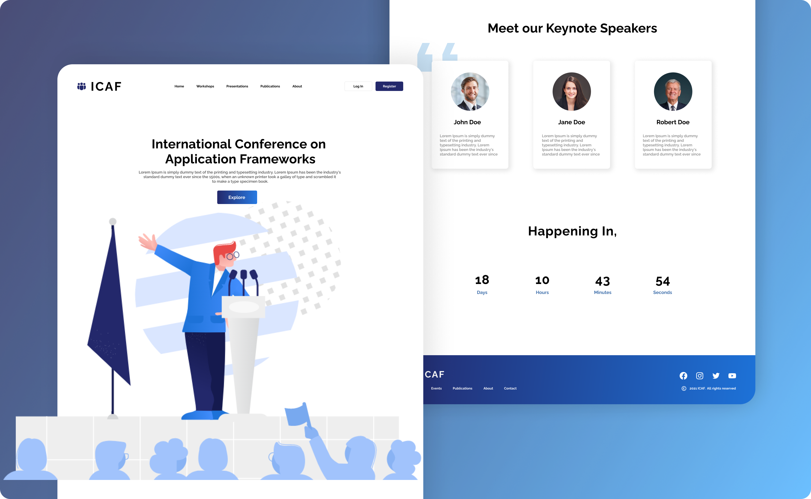

# International Conference on Application Frameworks | ICAF

The International Conference on Application Frameworks (ICAF) is presenting the academic conference organized by Sri Lanka Institute of Information Technology (SLIIT). We developed a conference management tool where users can present results, conduct workshops, submit research papers, publish blogs, register to the system and approve research papers and workshops. Research paper and workshop templates will be available for anyone to download. Users have to register to the system before using the above functionalities. In this conference, researchers will present their most recent results and implementations of several programming languages, such as Java, JavaScript, Python and PHP. The conference will take place at SLIIT premises. Mainly, four roles have access to this site; Admin, editor, reviewer, and the user. Users can register as a researcher, workshop presenter, or attendee.

### NOTE This project is developed just for assignment purposes.
